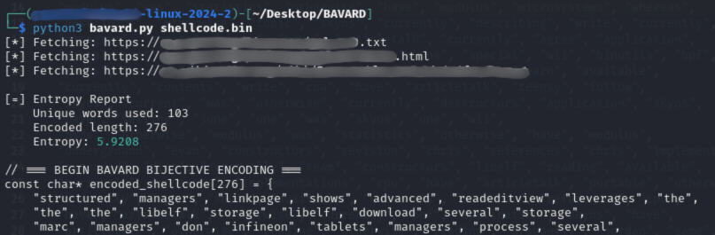
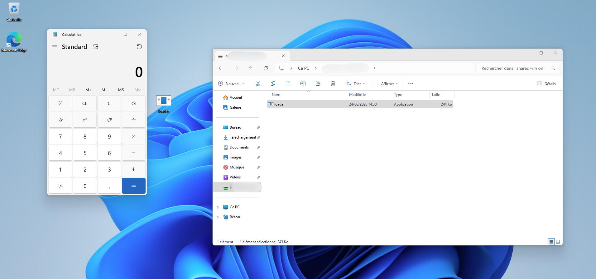

# BAVARD

**Byte-to-Associative Vocabulary Assembly for Runtime Decoding**  
> Bavard is an obfuscation script designed to help bypass static analysis.  
> It transforms raw shellcode into structured, human-readable word sequences embedded in C code, using domain-specific vocabulary to lower entropy and reduce heuristic detection.  
> This tool is intended **exclusively for cybersecurity research and educational purposes**.

---

## Features

- Converts shellcode bytes into word-based tokens (bijective mapping)
- Outputs standalone C code with embedded decoder logic
- Reduces entropy and improves stealth in static scans
- Extracts vocabulary from public legal/tech content (e.g. GNU, RFCs)
- Output can be pasted directly into a FUD-compatible loader
- Measures output entropy using **Shannon entropy formula**

---

## Why this approach?

Modern AV and EDR solutions often rely on high-entropy detection, shellcode heuristics, or static signatures. Bavard helps to circumvent these detections by:

- **Encoding shellcode as word arrays**, not byte arrays  
- **Using a real-world vocabulary** to reduce suspicion  
- **Avoiding classic hex or Base64 encoding**, which are easily flagged  
- Providing a decoding routine that is **clean, generic, and AV-transparent**

### Entropy analysis

Bavard computes the **Shannon entropy** of the encoded output. This metric reflects how uniformly distributed the symbols (words) are.  
Lower entropy generally corresponds to more “natural” or non-random data — which is less likely to be flagged by static heuristic engines.  
Since many static analysis engines rely on entropy thresholds to flag suspicious binaries, reducing the entropy of encoded payloads makes them statistically more likely to bypass such heuristics.

Bavard leverages this by encoding shellcode into structured, natural-language word sequences.

---

## Run Bavard encoder

```bash
python3 bavard.py <shellcode.bin>
```



---

## Integrate with loader.c

The loader provided (`loader.c`) is intended for demonstration purposes only — it is not FUD. Most antivirus engines will detect it immediately. It is meant to help understand how Bavard's output integrates, not to evade detection. Simply:

1. Copy the output from `bavard.py`
2. Paste it into the placeholder section of `loader.c`
3. Compile:

```bash
x86_64-w64-mingw32-gcc loader.c -o loader.exe
```

> The loader allocates memory, decodes the shellcode in runtime, and executes it. Suitable for sandbox or red team testing.

---

## Loader Runtime Example



---

## Decoding Function in C

```c
unsigned char* decode_shellcode() {
    int count = sizeof(encoded_shellcode) / sizeof(char*);
    unsigned char* result = (unsigned char*)malloc(count);
    for (int i = 0; i < count; i++) {
        for (int j = 0; ; j++) {
            if (decode_table[j].word == NULL) break;
            if (strcmp(encoded_shellcode[i], decode_table[j].word) == 0) {
                result[i] = decode_table[j].byte;
                break;
            }
        }
    }
    return result;
}
```

---

## Example: generating a test shellcode

```bash
# Create a simple shellcode to launch calc.exe
msfvenom -p windows/x64/exec CMD=calc.exe -f raw -o shellcode.bin

# Encode with Bavard
python bavard.py shellcode.bin > payload.c
```

Paste `payload.c` into `loader.c` and compile as shown earlier.

---

## Requirements

- Python 3.x
- `requests`, `bs4` (for HTML/text parsing)
- Optionally: `mingw-w64` (for cross-compilation)

Install Python dependencies:
```bash
pip install requests beautifulsoup4
```

---

## ❌ What this script does *not* do

While Bavard helps obfuscate shellcode for static embedding, it is **not a crypter or a complete dropper builder**.

Bavard is **only one obfuscation layer** in the broader chain of actions required to build a complete tool or loader.  
Its main purpose is **static encoding and entropy shaping** — not execution, evasion, or persistence.

---

## Disclaimer

This project is provided for **educational and authorized security research** purposes only.  
The author is not responsible for any misuse or unauthorized deployment.

---

## License

MIT
